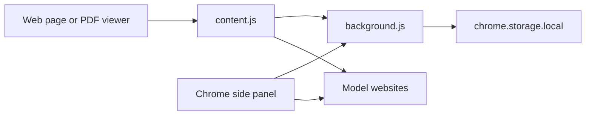
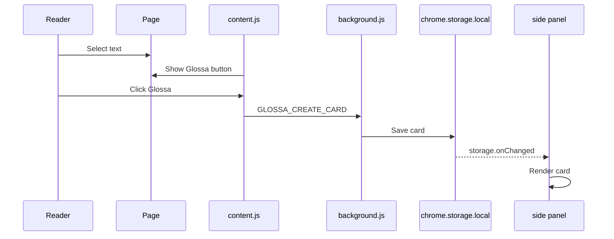
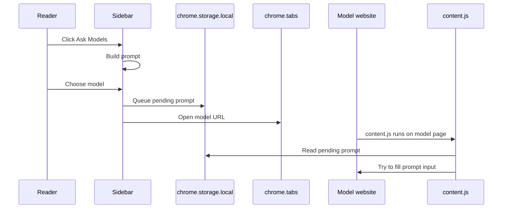

# Architecture

Glossa is a Manifest V3 Chrome extension. The current prototype has no build step and uses plain JavaScript, HTML, and CSS.

## Components



## Files

- `manifest.json` declares permissions, content scripts, background service worker, and side panel.
- `content.js` captures selected text on normal web pages and tries to autofill prompts on model pages.
- `background.js` stores cards, handles extension messages, and creates the selection context menu.
- `sidebar.html` defines the side-panel UI.
- `sidebar.js` renders cards, creates prompts, opens model pages, and queues autofill.
- `sidebar.css` styles the side panel.

## Data Model

Cards are stored in `chrome.storage.local` under `glossa.cards`.

```json
{
  "id": "uuid",
  "text": "selected source text",
  "url": "https://example.com/paper",
  "title": "Source page title",
  "parentId": "optional parent card id",
  "sourceLocation": {
    "scrollX": 0,
    "scrollY": 1200,
    "rectTop": 320,
    "rectLeft": 120,
    "textQuote": "short quote used for source lookup"
  },
  "createdAt": "2026-06-07T00:00:00.000Z"
}
```

Pending model prompts are stored under `glossa.pendingPrompts`.

```json
{
  "chatgpt": {
    "prompt": "full prompt text",
    "createdAt": 1780000000000
  }
}
```

The pending prompt is removed after successful autofill or after expiration.

## Capture Flow



## Ask Models Flow



## Model Autofill

Autofill uses a best-effort strategy:

1. Detect the model website by hostname.
2. Read the pending prompt for that model.
3. Observe DOM changes while the model page loads.
4. Search for common input targets:
   - `textarea`
   - `contenteditable`
   - `role="textbox"`
   - known prompt input IDs/classes
5. Set the prompt value and dispatch input/change events.
6. Show a small success toast.

The extension does not automatically submit the prompt. The user reviews and sends it manually.

## Question Graph

Cards may include a `parentId`. The side panel groups those cards into a tree:

- Root cards represent captured passages.
- Child cards represent follow-up questions.
- Deleting a parent card also removes descendants.

This is the first step toward a paper-level question graph.

## Back To Source

When a normal web page selection is saved, Glossa stores:

- source URL
- scroll position
- selected text quote
- selection rectangle position

The Source button opens the original URL and asks the content script to find and highlight the saved quote. If quote lookup fails, it falls back to the saved scroll position.

For Chrome PDF viewer pages, exact source jumping is limited by Chrome's PDF viewer restrictions.

## PDF Capture

Chrome's built-in PDF viewer does not expose normal page DOM to extension content scripts. This means Glossa cannot reliably draw the floating capture button inside the PDF viewer.

Current workaround:

1. Select text in the PDF.
2. Copy it.
3. Click Save Clipboard in the Glossa side panel.

Future options:

- Open PDFs in a custom extension viewer.
- Use a PDF.js-based reader.
- Add a browser action that saves clipboard text with active tab metadata.
- Explore native messaging only if local file workflows need it.

## Adapter Direction

The current model integration is hardcoded. A future adapter system should define:

```js
{
  id: "chatgpt",
  label: "ChatGPT",
  url: "https://chatgpt.com/",
  hostnames: ["chatgpt.com"],
  selectors: ["textarea[data-testid='prompt-textarea']", "#prompt-textarea"],
  fillStrategy: "textarea-or-contenteditable"
}
```

This would make it easier for contributors to add and maintain model websites.
